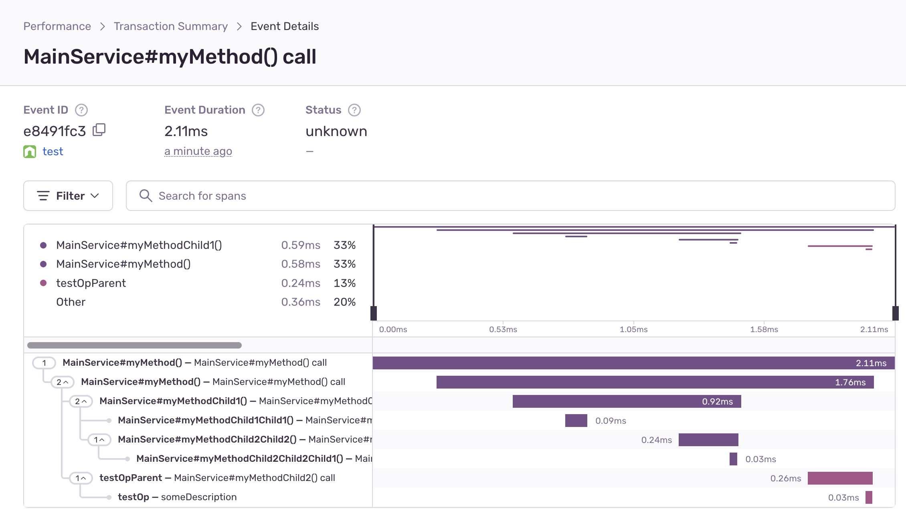

# sentry-traced

## Introduction

This package provides a decorator that can be used to annotate class methods with Sentry tracing information. The purpose of this decorator is to simplify the process of adding Sentry error reporting to a Node.js application, by automating the generation of Sentry tracing information for class methods.

## Installation

To install the Sentry decorator package, simply run the following command in your terminal:

```
npm install sentry-decorator
```

## Usage

To use the Sentry decorator, you must first import it into your project. You can do this by including the following line of code at the top of your file:

```ts
import { SentryTraced } from 'sentry-decorator';
```

Next, you can use the `@SentryTraced` decorator to annotate class methods that you want to generate Sentry tracing information for.

```ts
class MyClass {
  @SentryTraced()
  myMethod() {
    // method implementation
  }
}
```

Once you have annotated your class methods with the @SentryTraced decorator, the Sentry tracing information will be automatically generated and sent to Sentry each time the annotated methods are called.

For example:


### Nested methods

As your codebase evolves, there will be some cases where a decorated function will be called by another decorated function. In this case one transaction will be generated (the root node) along with a tree like structure of spans (tree nodes) from the call stack.

For example, the following code will generate a structure that is interpreted by Sentry as this:

```ts
export class MainService {
  @SentryTraced()
  async myMethod() {
    await this.myMethodChild1();
    await this.myMethodChild2();
  }

  @SentryTraced()
  async myMethodChild1() {
    await this.myMethodChild1Child1();
    await this.myMethodChild2Child2();
  }

  @SentryTraced()
  async myMethodChild1Child1() {}

  @SentryTraced()
  async myMethodChild2Child2() {
    await this.myMethodChild2Child2Child1();
  }

  @SentryTraced()
  async myMethodChild2Child2Child1() {}

  @SentryTraced({ op: 'testOpParent' })
  async myMethodChild2() {
    const mainServiceChild = new MainServiceChild();
    mainServiceChild.mainServiceChildMethod();
  }
}

class MainServiceChild {
  @SentryTraced({ op: 'testOp', description: 'someDescription' })
  async mainServiceChildMethod() {}
}

const mainService = new MainService();
mainService.myMethod();
```



### Adding named parameters

The `sentry-traced` package provides the `@SentryParam()` decorator that can be used to annotate some parameters of a function.
This allows the values of these parameters to be added to the Sentry transaction as certain op.

```ts
class MainService {
  @SentryTraced()
  async myMethod(
    @SentryParam param1: number,
    @SentryParam param2: string,
    param3: string,
  ) {
    console.log('my method called', { param1, param2, param3 });
  }
}
```


