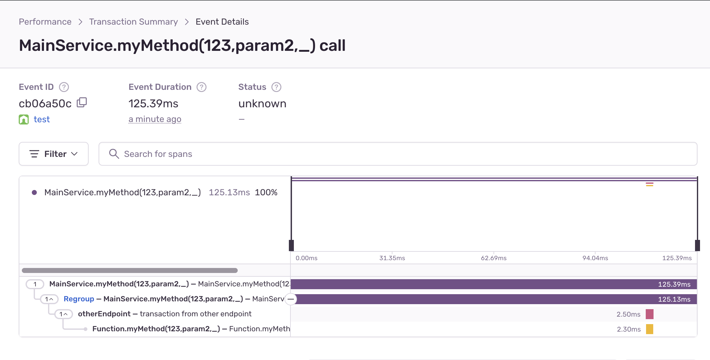

# sentry-traced

<p align="center"></p>
<p align="center">
     <a href="https://github.com/alexcambose/sentry-traced/actions/workflows/ci.yml">
      </a>
<a href="https://github.com/alexcambose/sentry-traced/issues"></a>
<a href="https://www.npmjs.com/package/sentry-traced"></a>
<a href="https://github.com/alexcambose/sentry-traced/blob/master/LICENSE"></a>
</p>

This package provides a decorator that can be used to annotate class methods with Sentry tracing information. The purpose of this decorator is to simplify the process of adding Sentry error reporting to a Node.js application, by automating the generation of Sentry tracing information for class methods.

See this article for more details about the implementation of this project: https://medium.com/@alexcambose/sentry-tracing-decorator-in-typescript-6d9607858ece

## Installation

To install the Sentry decorator package, simply run the following command in your terminal:

```
npm install sentry-traced
```

## Usage

To use the Sentry decorator, you must first import it into your project. You can do this by including the following line of code at the top of your file:

```ts
import { SentryTraced } from 'sentry-traced';
```

Next, you can use the `@SentryTraced` decorator to annotate class methods that you want to generate Sentry tracing information for.

```ts
class MyClass {
  @SentryTraced()
  myMethod() {
    // method implementation
  }
}
```

Once you have annotated your class methods with the @SentryTraced decorator, the Sentry tracing information will be automatically generated and sent to Sentry each time the annotated methods are called.

For example:


### Nested methods

As your codebase evolves, there will be some cases where a decorated function will be called by another decorated function. In this case one transaction will be generated (the root node) along with a tree like structure of spans (tree nodes) from the call stack.

For example, the following code will generate a structure that is interpreted by Sentry as this:

```ts
export class MainService {
  @SentryTraced()
  async myMethod() {
    await this.myMethodChild1();
    await this.myMethodChild2();
  }

  @SentryTraced()
  async myMethodChild1() {
    await this.myMethodChild1Child1();
    await this.myMethodChild2Child2();
  }

  @SentryTraced()
  async myMethodChild1Child1() {}

  @SentryTraced()
  async myMethodChild2Child2() {
    await this.myMethodChild2Child2Child1();
  }

  @SentryTraced()
  async myMethodChild2Child2Child1() {}

  @SentryTraced({ op: 'testOpParent' })
  async myMethodChild2() {
    const mainServiceChild = new MainServiceChild();
    mainServiceChild.mainServiceChildMethod();
  }
}

class MainServiceChild {
  @SentryTraced({ op: 'testOp', description: 'someDescription' })
  async mainServiceChildMethod() {}
}

const mainService = new MainService();
mainService.myMethod();
```


### Adding named parameters

The `sentry-traced` package provides the `@SentryParam()` decorator that can be used to annotate some parameters of a function.
This allows the values of these parameters to be added to the Sentry transaction as certain op.

```ts
class MainService {
  @SentryTraced()
  async myMethod(
    @SentryParam param1: number,
    @SentryParam param2: string,
    param3: string,
  ) {
    console.log('my method called', { param1, param2, param3 });
  }
}
```


## Distributed tracing

Distributed tracing can be used to follow and analyze the path of requests as they move through various components or services. To achieven
this, the `sentry-traced` package provides the `withTracing` function that takes in the traceparent data and returns a function that can be used to wrap the code that needs to be traced.

Here's an example:

```ts
export class MainService {
  @SentryTraced()
  async myMethod(
    @SentryParam param1: number,
    @SentryParam param2: string,
    param3: string,
  ) {
    // get the current sentry span that surrounds this method
    const span = Sentry.getCurrentHub().getScope()?.getSpan();
    // call another endpoint and pass the traceparent header
    const result = await fetch('http://localhost:3000/other-endpoint', {
      headers: {
        'sentry-trace': span.toTraceparent(),
      },
    });
  }
}

export class SecondService {
  @SentryTraced()
  async myMethod(
    @SentryParam param1: number,
    @SentryParam param2: string,
    param3: string,
  ) {
    console.log('my second service method called', { param1, param2, param3 });
  }
}

const mainService = new MainService();
const secondService = new SecondService();

app.get('/', async (req, res) => {
  await mainService.myMethod(123, 'param2', 'param3');
  res.send('ok!');
});

app.get('/other-endpoint', async (req, res) => {
  // get the sentry traceparent header
  const sentryTrace = req.headers['sentry-trace'] as string;
  // wrap the second service method with `withTracing` and pass in the traceparent header
  // additionally you can pass in the operation name and description
  const result = withTracing(sentryTrace, {
    op: 'otherEndpoint',
    description: 'transaction from other endpoint',
  })(secondService.myMethod)(123, 'param2', 'param3');

  res.send('ok!');
});
```

the result transaction will appear in Sentry as follows:


# Contributing

Contributions are welcome! Please check the contribution guidelines before submitting a pull request.

# Issues

If you encounter any issues or have suggestions, please open an issue.

# License

This project is licensed under the MIT License.

---

Feel free to reach out to me at alexcambose1@gmail.com if you have any questions or need further assistance.

Thanks for using **sentry-traced**!

:star:
